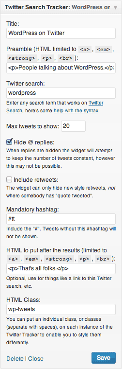
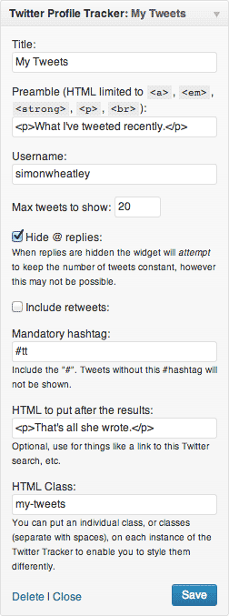

# Twitter Tracker

* Contributors: simonwheatley, codeforthepeople, s1m0nd
* Tags: twitter, tweet, twitter search, hashtag, summize, twitter profile, tweet stream, tweet feed
* Requires at least: 3.1.0
* Tested up to: 3.5
* Stable tag: 3.3.6

Track Twitter search results, a Twitter hashtag, or a Twitter profile using sidebar widgets.

## Description

A widget, Twitter Search Tracker, which allows you to specify and display a [Twitter search](http://twitter.com/) (or a Twitter hashtag) in your sidebar. Twitter searches are [very flexible](http://twitter.com/operators), and you can display anything from Hashtags to individual, or aggregated Twitter streams.

Another widget, Twitter Profile Tracker, allows you to show the tweets from a specific user in your sidebar.

With the profile and search widget, you can choose to only show tweets with a particular hashtag, to control which tweets get shown on your site. You can also elect not to show retweets or "@" replies.

By default this plugin uses a Twitter API to provide avatar images, unfortunately this process triggers Twitter to drop some cookies on visitors. If you want to continue using avatars in your widgets are avoid Twitter cookies, you can use the partner plugin [Twitter Tracker Avatar Cache](http://wordpress.org/extend/plugins/twitter-tracker-avatar-cache/). If you want to avoid the use of cookies, and don't need avatars in your widget (or are hiding the avatars with CSS) then you can use the [Twitter Tracker Blank Avatars](http://wordpress.org/extend/plugins/twitter-tracker-blank-avatars/) partner plugin.

## Other Notes

The plugin puts "Twitter Tracker" fields in the post and page screens, you can enter a specific query into this metabox and this will override the query entered on the widget editor... this means you can have individual Twitter search queries in the widget for each of your posts and pages. If you enter nothing in those fields then the widget will use the Twitter search query on the widget editor screen. (Developers, you can add this metabox to custom post types although you will need to use the `tt_post_types_with_override` filter to get the metabox fields to save... check out the code.)

The HTML output is fairly well classed, but if you need to adapt it you can. Create a directory in your *theme* called "view", and a directory within that one called "category-images-ii". Then copy the template files `view/twitter-tracker/widget-content.php` and `view/twitter-tracker/widget-error.php` from the plugin directory into your theme directory and amend as you need. If these files exist in these directories in your theme they will override the ones in the plugin directory. This is good because it means that when you update the plugin you can simply overwrite the old plugin directory as you haven't changed any files in it. All hail [John Godley](http://urbangiraffe.com/) for the code which allows this magic to happen.

## Filters And Actions

These notes mainly for developers:

`tt_avatar_url` filters – Use this to change the Twitter Avatar URLs provided to the template. The [Twitter Tracker Avatar Cache](http://wordpress.org/extend/plugins/twitter-tracker-avatar-cache/) partner plugin uses these filters to provide cookie stripping caching for these avatars.

(NOTE: The `tt_avatar_bigger_url` filter no longer exists, as I cannot find a way to access larger icons with the Twitter API.)

`tt_post_types_with_override` filter – Add or remove post types which can override the search query in a search widget.

`tt_allowed_html` filter – WARNING – incorrect use of this filter could make your website vulnerable to cross-site scripting attacks; if in doubt, do not use it. Amend the HTML elements and attributes allowed in the preamble and HTML after values. This filter passes a second param specifying the context the allowed HTML is for.

`tt_cache_expiry` filter – The default cache for each widget is 300 seconds. Hook this filter to change this, but do not lower it too much on busy sites as you'll run out of API accesses and your site will be slower.

`tt_no_tweets` filter – The string displayed in the search widget when no tweets are found.  The second parameter passed is the search string being used, and the third parameter is an array of other variables relating to this widget and search request.

## Translations

* Dutch translation by Milo van der Linden of [De OpenGeoGroep](http://www.opengeogroep.nl/)
* Slovak translation by Branco Radenovich of [Web Hosting Geeks](http://webhostinggeeks.com/user-reviews/)

## Provenance And Plans

Plugin initially produced on behalf of [WordCamp UK, 2009](http://wordcamp.org.uk). Initial version 2 development funded by SamFry Ltd.

Any issues: [contact me](http://www.simonwheatley.co.uk/contact-me/).

Development for [this plugin is hosted on Github](https://github.com/cftp/twitter-tracker), feel free to fork and submit issues there.

## Installation

**IMPORTANT:** You need to authorise with Twitter for this plugin to work. Follow the authorisatiuon steps below.

###= Installation: ===

1. Download `twitter-tracker.zip`
1. Unzip
1. Upload `twitter-tracker` directory to your `/wp-content/plugins` directory
1. Go to the plugin management page and enable the plugin
1. Now go through the authorisation steps below

OR:

1. From your admin area, choose "Plugins" then "Add New"
1. Search for "Twitter Tracker"
1. Select "Install Now"
1. Give yourself a pat on the back
1. Now go through the authorisation steps below

###= Authorisation: ===

1. Go to "Settings" > "Twitter Tracker Auth"
1. Click on "Authorise with Twitter" and follow the prompts

## Upgrade Notice

### v3.3.6 

Fixes a bug to restore caching of requests to the Twitter API.

### v3.3.5 

Fixes the plugin to work with Twitter's new API (and new constraints). After installing this update, you will be prompted to authorise with Twitter, just follow the prompts. Also adds an option to work with Emoji.

## Change Log

### v3.3.6 

Tuesday 13 August 2013

* BUGFIX: Restore caching of requests to Twitter API

### v3.3.5 

Thursday 18 July 2013

* BUGFIX: Fix name clash by renaming a class (hopefully the last one)
* ENHANCEMENT: Show message in search widget when no tweets are found
* ENHANCEMENT: Add `tt_no_tweets` filter to tailor "no tweets" message

### v3.3.3 

Thursday 27 June 2013

* Fix missing files

### v3.3.2 

Thursday 27 June 2013

* Now uses Twitter's API v1.1 (requires someone to authenticate their account with Twitter)
* Adds the ability to show or filter out Emoji

### v3.2.1 

25 February, 2013

* Tweaked some HTML in the template to make it valid.

### v3.2 

29 January, 2013

* TRANSLATION: Added Slovak translation

### v3.1 

18 January, 2013

* TRANSLATION: Added Dutch translation

### v3.0 

4 January, 2013

* ENHANCEMENT: Allow each post/page/custom post type to override the Profile Widget username

### v2.9 

* BUGFIX: Properly escape values in widget form for users who can't use unfiltered_html
* BUGFIX: Limit HTML elements available in preamble and html_after for users who can't use unfiltered_html

### v2.8.2 

* BUGFIX: Fixed bug in profile widget with custom classes. Thanks again to [@heidi_ulrich](https://twitter.com/heidi_ulrich)

### v2.8.1 

* BUGFIX: Fixed an HTML error whereby an A element (link) had an alt attribute
* BUGFIX: Fixed an error seemingly introduced with the last release whereby the tweets would be replaced by the number 1 for the profile widget – thanks for reporting the bug [@heidi_ulrich](https://twitter.com/heidi_ulrich)

### v2.8 

* BUGFIX: Text truncation for retweets no longer occurs.
* BUGFIX: Fix some PHP notices due to unset variables.
* BUGFIX: Remove stray error_log calls.

### v2.7 

* ENHANCEMENT: Add option to Profile widget to include retweets.

### v2.6.1 

* Apologies, I messed up with the last release and didn't change the version number from v2.5 to v2.6 everywhere. This version (v2.6.1) should remove the upgrade nag. No other changes.

### v2.6 

* ENHANCEMENT: Add `tt_avatar_url` and `tt_avatar_bigger_url` filters, required by [Twitter Tracker Avatar Cache](http://wordpress.org/extend/plugins/twitter-tracker-avatar-cache/) plugin to do it's thing.
* CHANGE: Plugin now requires WordPress v3.1.0, actually it required this for v2.5 of the plugin but I didn't notice.

### v2.5 

* BUGFIX: Use `wp_kses_data` instead of `wp_filter_kses` (to avoid slashes being added)
* ENHANCEMENT: Add more sensible tt_post_types_with_override filter name and warn devs to use `tt_post_types_with_override` instead of deprecated `tt_allowed_post_types` filter. Extend the use of this filter so it can prevent display of the meta box.
* ENHANCEMENT: Default to 3 tweets in widget settings

### v2.4 

* BUGFIX: Call metaboxes from add_meta_boxes action, as they should be
* ENHANCEMENT: Add generic filter `tt_cache_duration` to control all cache durations
* ENHANCEMENT: Add `tt_search_cache_duration` to control Twitter Search Tracker cache duration, overrides generic cache filter
* ENHANCEMENT: Add `tt_profile_cache_duration` to control Twitter Profile Tracker cache duration, overrides generic cache filter
* BUGFIX: Avoid notices by checking if variables are set before using them when creating widgets in admin area

### v2.3 

* SECURITY: Tightened up on the escaping and filtering of content received from Twitter, just in case.
* BUGFIX: Don't throw exceptions when we hit an HTTP error (not helpful on production sites)
* BUGFIX: Now accessing the non-HTMLified version of the tweets in a search, then adding the links manually as this seems more reliable.
* BUGFIX: Fix 'Undefined variable' PHP Notices when WP_DEBUG is set to true.
* TWEAK: Set a default for the mandatory hashtag arg for TwitterSearch `__construct`

### v2.2 2011/05/13 

* ENHANCEMENT: Adds a Twitter Profile Tracker widget, which shows the tweets from just one user.
* ENHANCEMENT: Specify a "Mandatory Hashtag" to filter out any tweets which don't have a particular hashtag (e.g. "#show_on_front_page")

### v2.12 2009/10/27 

* ENHANCEMENT: Adds the ability to enter a local query for each individual page and post, this local query overrides the query entered on the widgets screen
* ENHANCEMENT: Use the new (to me) Twitter profile pic API to get the images
* BUGFIX: Use the new (to me) Twitter profile pic API to get the images
* BUGFIX: May have stomped the -1 year ago problem, where tweets were showing as tweeted -1 years ago.

### v2.11 2009/10/27 

* ARGH: Version numbers getting confused, so I'm trying this renumbering to hopefully cut through that confusion.

### v2.1 2009/10/13 

* BUGFIX: Default template now doesn't throw a PHP error. Oops!
* ENHANCEMENT: Default template now uses Twit name, rather than the "twitter username (actual name)" format
* BUGFIX: URL encoded the query, so now works with spaces in the query

### v2.01 2009/07/12 

* Now allows the assignment of an individual class to each instance of the widget, good for styling your different Tweet streams to differentiate between them.

### v2.00 2009/05/11 

* Now using the all new WordPress 2.8 widget capabilities, soooo much easier.
* Various internal massaging.
* ENHANCEMENT: You can now hide @ replies.
* ENHANCEMENT: You can now add text after the results (e.g. for a link to the Twitter search you are using)

### v1.41 2009/04/20 

* ENHANCEMENT: Added a class "preamble" to the P element containing the preamble.
* BUGFIX: Slashes no longer breed and multiply in the title, preamble and search.

### v1.4 2009/04/20 

* ENHANCEMENT: Added class "twitter-tracker" to the widget.
* ENHANCEMENT: Added a description to show in the widget admin page.

### v1.3 2009/04/10 

* ENHANCEMENT: Now you can specify the number of Tweets in the widget config.

### v1.2 2009/04/10 

* FIX: Bug with time since information, now replaced with an i18n local date.

### v0.90b 2009/03/03 

* RELEASE: Version 0.90b

## Screenshots

_The search widget_

_The user profile widget_

